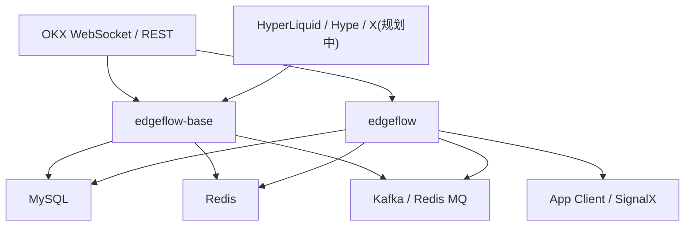
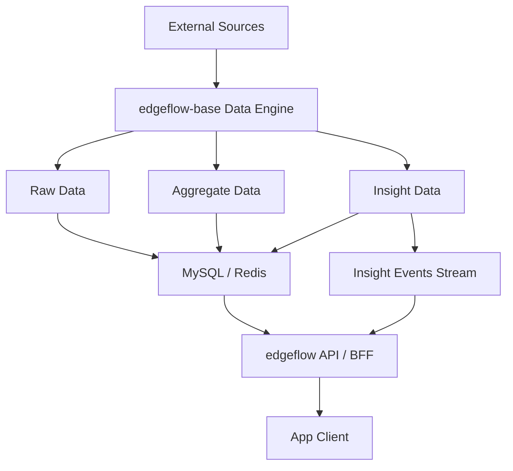
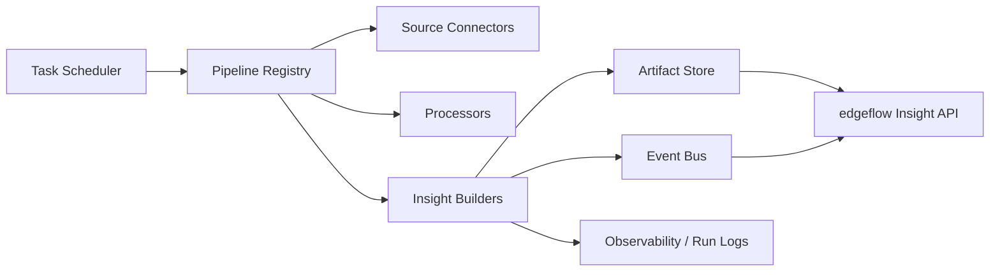

# Edgeflow Insight 架构梳理与工具层方案

## 1. 目标

这份文档解决 4 件事：

- 还原 `edgeflow` 和 `edgeflow-base` 当前真实架构
- 明确两个项目的模块边界和职责归属
- 给出面向 MVP 的改造顺序
- 设计第一版围绕 `任务编排 / 数据链路 / insight 产物` 的工具层

这份文档和 [insight-tool-backend-requirements.md](/Users/xiaoyuan/Documents/work/git/edgeflow-server/edgeflow/docs/insight-tool-backend-requirements.md:1) 的关系是：

- 那份文档回答“产品和前端要什么数据”
- 这份文档回答“现有系统是什么、应该怎么改、工具层怎么接”

## 2. 当前项目现状

当前仓库里有两套 Go 服务：

- `edgeflow-base`：偏数据生产和分析
- `edgeflow`：偏 API、WebSocket 和前台聚合

从代码入口来看：

- `edgeflow-base` 启动入口在 [edgeflow-base/cmd/main.go](/Users/xiaoyuan/Documents/work/git/edgeflow-server/edgeflow-base/cmd/main.go:1)
- `edgeflow` 启动入口在 [edgeflow/cmd/main.go](/Users/xiaoyuan/Documents/work/git/edgeflow-server/edgeflow/cmd/main.go:1)

### 2.1 当前架构图

### 2.2 当前真实职责

#### `edgeflow-base`

当前主要负责：

- 定时抓取 HyperLiquid 排行、仓位和胜率
- 拉取 OKX K 线
- 计算趋势和交易信号
- 写入数据库
- 发送部分系统级变更消息

核心代码位置：

- 启动与任务注册：[edgeflow-base/cmd/main.go](/Users/xiaoyuan/Documents/work/git/edgeflow-server/edgeflow-base/cmd/main.go:1)
- Hyper 任务：[edgeflow-base/internal/task/hyper.go](/Users/xiaoyuan/Documents/work/git/edgeflow-server/edgeflow-base/internal/task/hyper.go:1)
- K 线任务：[edgeflow-base/internal/task/kline.go](/Users/xiaoyuan/Documents/work/git/edgeflow-server/edgeflow-base/internal/task/kline.go:1)
- K 线缓存与抓取：[edgeflow-base/internal/service/signal/kline/service.go](/Users/xiaoyuan/Documents/work/git/edgeflow-server/edgeflow-base/internal/service/signal/kline/service.go:1)
- 趋势监听器：[edgeflow-base/internal/service/signal/trend/trend.go](/Users/xiaoyuan/Documents/work/git/edgeflow-server/edgeflow-base/internal/service/signal/trend/trend.go:1)
- 信号生成器：[edgeflow-base/internal/service/signal/signal.go](/Users/xiaoyuan/Documents/work/git/edgeflow-server/edgeflow-base/internal/service/signal/signal.go:1)
- Hyper 聚合服务：[edgeflow-base/internal/service/hyperliquid.go](/Users/xiaoyuan/Documents/work/git/edgeflow-server/edgeflow-base/internal/service/hyperliquid.go:1)

#### `edgeflow`

当前主要负责：

- 对外 REST API
- 对外 WebSocket gateway
- 实时 ticker 接入和内存聚合
- K 线订阅转发
- 市场详情聚合
- 用户、提醒、部分 Hyper 查询

核心代码位置：

- 初始化依赖：[edgeflow/cmd/edgeflow/init.go](/Users/xiaoyuan/Documents/work/git/edgeflow-server/edgeflow/cmd/edgeflow/init.go:1)
- 路由注册：[edgeflow/internal/router/router.go](/Users/xiaoyuan/Documents/work/git/edgeflow-server/edgeflow/internal/router/router.go:1)
- 市场聚合服务：[edgeflow/internal/service/market.go](/Users/xiaoyuan/Documents/work/git/edgeflow-server/edgeflow/internal/service/market.go:1)
- Ticker 实时接入：[edgeflow/internal/service/ticker.go](/Users/xiaoyuan/Documents/work/git/edgeflow-server/edgeflow/internal/service/ticker.go:1)
- Candle 实时接入：[edgeflow/internal/service/okx_pub_ws.go](/Users/xiaoyuan/Documents/work/git/edgeflow-server/edgeflow/internal/service/okx_pub_ws.go:1)
- Ticker Gateway：[edgeflow/internal/handler/ticker/ticker_gateway.go](/Users/xiaoyuan/Documents/work/git/edgeflow-server/edgeflow/internal/handler/ticker/ticker_gateway.go:1)
- Market Gateway：[edgeflow/internal/handler/market/subscription_gateway.go](/Users/xiaoyuan/Documents/work/git/edgeflow-server/edgeflow/internal/handler/market/subscription_gateway.go:1)

## 3. 当前系统的核心问题

当前架构方向没有错，但实现上有 4 个明显问题。

### 3.1 `edgeflow` 还不是纯 BFF

理论上 `edgeflow` 应该偏 API/BFF，只负责：

- 聚合
- 鉴权
- 协议整形
- 给前端返回页面所需结构

但现在它还直接承担：

- OKX ticker WebSocket 连接
- OKX candle WebSocket 连接
- 实时内存态市场数据维护
- Kafka 消费和广播

这导致 `edgeflow` 同时扮演了：

- BFF
- 实时行情网关
- 一部分数据引擎

### 3.2 `edgeflow-base` 更像“信号引擎”，还不是“insight 引擎”

`edgeflow-base` 现在产出的核心还是：

- K 线
- 趋势
- 信号
- 鲸鱼统计

它还没有系统地产出：

- `sentiment_score`
- `attention_score`
- `narrative_tags`
- `reason_summary`
- `timeline_event`
- `digest`

也就是缺少真正面向产品语义的“解释层数据”。

### 3.3 消息层存在双轨

当前仓库里同时存在两套消息抽象：

- Kafka 实现：
  [edgeflow/pkg/kafka](/Users/xiaoyuan/Documents/work/git/edgeflow-server/edgeflow/pkg/kafka/kafka_producer.go:1)
  [edgeflow-base/pkg/kafka](/Users/xiaoyuan/Documents/work/git/edgeflow-server/edgeflow-base/pkg/kafka/kafka_producer.go:1)
- Redis Pub/Sub 风格 MQ：
  [edgeflow-base/pkg/mq](/Users/xiaoyuan/Documents/work/git/edgeflow-server/edgeflow-base/pkg/mq/producer.go:1)

这说明系统已经在尝试从重型 Kafka 迁移到更轻的单机场景方案，但还没有统一。

### 3.4 现有接口主语还是 `market` 和 `signal`

当前 `edgeflow` 对前端暴露的主接口仍然偏：

- `instruments`
- `market`
- `signal`
- `hyperliquid`

而新的产品目标需要新增一层独立的：

- `insight/market/*`
- `insight/assets/*`
- `insight/narratives/*`

不应该继续把新版产品语义硬塞进旧 `signal` 或旧 `market/detail`。

## 4. 模块边界建议

下面是建议的目标边界。

### 4.1 目标架构图

### 4.2 `edgeflow-base` 的目标职责

保留并强化：

- 数据采集
- 定时分析
- 特征计算
- 事件生成
- Insight 数据落库

逐步新增：

- 情绪计算器
- 热度计算器
- 叙事归类器
- 事件生成器
- Digest 生成器

逐步弱化：

- 面向前端协议的逻辑
- 与页面结构强耦合的字段拼装

一句话定义：

`edgeflow-base` 是数据引擎，不是接口服务。

### 4.3 `edgeflow` 的目标职责

保留：

- REST API
- WebSocket API
- 权限和订阅控制
- 聚合和页面协议整形

逐步收缩：

- 自己维护的重型实时市场逻辑
- 自己直接做洞察计算

一句话定义：

`edgeflow` 是产品 API 层，不是主分析引擎。

### 4.4 数据层边界

建议正式分成 3 层：

#### Layer 1: Raw Data

包括：

- 原始行情
- 原始社媒抓取
- 原始新闻 / X / hype 数据

特点：

- 保留短周期
- 便于回放和追查

#### Layer 2: Aggregate Data

包括：

- 1m / 5m / 15m K 线
- mention count
- heat change
- narrative co-occurrence

特点：

- 作为中间层
- 提供较稳定的分析输入

#### Layer 3: Insight Data

包括：

- asset insight summary
- market overview
- timeline event
- digest
- narrative snapshot

特点：

- 这是产品直接消费的数据层
- 也是真正应该长期沉淀的核心资产

## 5. 第一版 Insight 数据模型

第一版不求全，但建议先把产物层定义稳定。

### 5.1 Asset Insight Snapshot

建议核心字段：

- `instrument_id`
- `symbol`
- `sentiment_score`
- `sentiment_change`
- `attention_score`
- `attention_change`
- `mention_count`
- `mention_change_pct`
- `narrative_tags`
- `risk_level`
- `divergence_score`
- `reason_summary`
- `updated_at`

### 5.2 Timeline Event

建议核心字段：

- `event_id`
- `instrument_id`
- `event_type`
- `title`
- `summary`
- `timestamp`
- `impact_level`
- `sentiment_direction`
- `marker_price`
- `related_narrative`
- `related_source_type`

### 5.3 Market Overview Snapshot

建议核心字段：

- `sentiment`
- `risk_appetite`
- `headline_narratives`
- `summary`
- `updated_at`

### 5.4 Digest Item

建议核心字段：

- `digest_id`
- `instrument_id`
- `source_type`
- `source_name`
- `published_at`
- `summary`
- `sentiment`
- `related_narratives`

## 6. 改造顺序

改造建议分 4 个阶段，避免一次性大改。

### Phase 0: 统一认知和协议

目标：

- 先冻结 `insight` 领域模型
- 先冻结 Phase 1 的 5 个接口协议
- 明确哪些字段由 `edgeflow-base` 负责产出
- 明确哪些字段由 `edgeflow` 负责聚合

交付物：

- 本文档
- `insight-tool-backend-requirements.md`
- 5 个接口协议定义

### Phase 1: 建立 Insight 产物层

目标：

- 在 `edgeflow-base` 内新增 insight 产物流水线
- 不先动旧 `signal` 和旧 `market` 逻辑
- 先让新旧并行

优先产物：

- `market overview`
- `asset summary`
- `asset timeline`
- `asset digest`
- `watchlist candidates`

这一阶段的重点不是“高精度模型”，而是先把数据链路闭环。

### Phase 2: API 层接入新 Insight

目标：

- `edgeflow` 新增 `insight/*` handler、service、dao
- 优先走 REST
- 尽量不把实时 websocket 复杂度引入到第一版 insight API

优先接口：

- `GET /api/v1/insight/market/overview`
- `GET /api/v1/insight/market/watchlist`
- `GET /api/v1/insight/assets/{instrument_id}/summary`
- `GET /api/v1/insight/assets/{instrument_id}/timeline`
- `GET /api/v1/insight/assets/{instrument_id}/digest`

### Phase 3: 收缩旧职责

目标：

- 逐步把洞察计算从 `edgeflow` 移出
- 把 `edgeflow` 的角色收紧成 API/BFF
- 对消息层做统一封装

可能动作：

- 抽象统一 `message bus` 接口
- MVP 默认使用轻量实现
- Kafka 变为可选部署能力

### Phase 4: 扩展为真正的数据产品

目标：

- 叙事页
- 多维榜单
- 用户态 watchlist insight
- 高级提醒
- 更丰富的数据来源接入

## 7. 第一版工具层方案

这里的“工具层”不是给用户直接看的页面，而是给系统内部和研发协同使用的一层能力，目的是把 `任务编排 / 数据链路 / insight 产物` 做成可观察、可扩展、可替换。

### 7.1 工具层目标

第一版工具层要解决 5 个问题：

- 不同数据任务如何统一注册和调度
- 每条数据链路的输入输出是什么
- 每种 insight 产物是怎么生成的
- 每次产物生成是否成功、耗时多少、覆盖了哪些资产
- 未来接入新来源时，如何最少改动地扩展

### 7.2 工具层总体结构

### 7.3 模块拆分建议

第一版工具层建议放在 `edgeflow-base` 内部，以 package 方式存在，不单独起第三个服务。

建议模块如下。

#### A. Task Scheduler

职责：

- 注册任务
- 定义频率
- 启停任务
- 控制并发和重入

当前可复用基础：

- `cron` 调度已经存在
- `TryFetchLeaderboardData` 这类防重入模式已经存在

建议演进方向：

- 不再直接在 `main.go` 堆任务
- 改为统一任务注册表

#### B. Pipeline Registry

职责：

- 用统一方式描述一条 pipeline
- 明确输入源、处理器、输出产物
- 让任务和数据链路可枚举

一条 pipeline 至少要描述：

- `name`
- `trigger`
- `inputs`
- `processors`
- `artifacts`
- `owner`
- `sla`

#### C. Source Connectors

职责：

- 对接 OKX
- 对接 HyperLiquid
- 对接 X / news / hype

原则：

- connector 只负责取数和标准化
- 不直接输出页面字段

#### D. Processors

职责：

- 清洗
- 聚合
- 计算基础特征
- 生成中间指标

这层产物偏：

- mention stats
- rolling heat
- trend shift
- divergence

#### E. Insight Builders

职责：

- 把 feature 组装成最终 insight 产物
- 输出 snapshot、event、digest

这层是“解释层”的核心，不应该散在各处 service 里。

#### F. Artifact Store

职责：

- 持久化 insight 产物
- 提供 API 层查询所需的数据模型

建议：

- 快照类走 DB
- 高频短期缓存可进 Redis
- 原始文本或中间件视成本选择保留周期

#### G. Run Logs / Observability

职责：

- 记录每个任务的开始、结束、耗时、状态
- 记录每个 pipeline 最后成功时间
- 记录产物条数和覆盖资产数

第一版哪怕先只写 DB 表或日志，也非常值得做。

### 7.4 第一版建议实现的 5 条 pipeline

#### 1. Market Overview Pipeline

输入：

- 核心资产价格变化
- 热点资产 attention 变化
- 叙事聚合结果

输出：

- `market_overview_snapshot`

频率建议：

- 5 分钟

#### 2. Asset Summary Pipeline

输入：

- 单资产价格和波动
- mention / heat / narrative 特征
- 已有趋势和 signal 结果

输出：

- `asset_insight_snapshot`

频率建议：

- 5 分钟或 15 分钟

#### 3. Timeline Event Pipeline

输入：

- 信号变化
- 热度突变
- 叙事切换
- 鲸鱼行为

输出：

- `asset_timeline_event`

触发建议：

- 批处理扫描 + 阈值触发

#### 4. Digest Pipeline

输入：

- hype / X / news 文本源

输出：

- `asset_digest_item`

频率建议：

- 10 分钟或 30 分钟

#### 5. Watchlist Candidate Pipeline

输入：

- asset insight snapshot
- event
- divergence

输出：

- `watchlist_candidate`

频率建议：

- 5 分钟

### 7.5 工具层与两个项目的关系

#### `edgeflow-base`

负责：

- 跑 pipeline
- 产出 insight artifacts
- 记录 pipeline run logs

#### `edgeflow`

负责：

- 查询 artifacts
- 做轻量聚合
- 给前端暴露 `insight/*` 协议

### 7.6 工具层的设计原则

- 任务定义和业务逻辑分离
- 数据接入和页面协议分离
- 中间特征和最终产物分离
- 消息总线可替换
- 先可观察，再求复杂

## 8. 对现有模块的处理建议

### 8.1 继续复用的部分

- `edgeflow` 里的实时 ticker 能力
- `edgeflow` 里的实时 candle 订阅能力
- 现有 K 线 marker 渲染链路
- `edgeflow-base` 里的 K 线抓取、趋势、signal 基础能力
- Hyper 数据采集和聚合能力

### 8.2 不建议继续放大的部分

- 继续扩 `signal` 接口去承担首页和详情页洞察
- 继续把 `market/detail` 变成越来越重的超级接口
- 继续在 `edgeflow` 内堆新的分析逻辑

### 8.3 需要新建的领域

- `insight snapshot`
- `insight event`
- `insight digest`
- `narrative snapshot`
- `pipeline run log`

## 9. 建议的近期落地顺序

按执行顺序建议这样推进：

1. 先冻结 Phase 1 的 5 个 `insight` 接口协议。
2. 在 `edgeflow-base` 内定义第一版 artifact 模型和 pipeline 注册方式。
3. 先产出 `market overview` 和 `asset summary` 两类快照。
4. 再补 `timeline` 和 `digest`。
5. 最后由 `edgeflow` 接入查询接口，形成闭环。

这样做的好处是：

- 不打断现有 `market/signal` 业务
- 先得到最关键的 Insight MVP
- 让新旧链路并行一段时间，降低风险

## 10. 最终结论

当前两个项目的方向是对的，但边界仍然有些“平台化过早”：

- `edgeflow-base` 已经是数据引擎雏形，但还需要从“信号引擎”升级为“insight 引擎”
- `edgeflow` 已经是 API 层雏形，但还需要从“实时网关 + API 混合体”收缩为更清晰的 BFF

最合理的路径不是推翻重做，而是：

- 保留现有实时价格、K 线、marker 基础能力
- 新增独立的 insight 数据层
- 用工具层把任务编排、数据链路和产物沉淀统一起来

这样改完之后，系统会从“行情/信号服务”更自然地演进成“Crypto Insight Data Engine + Insight API”。
